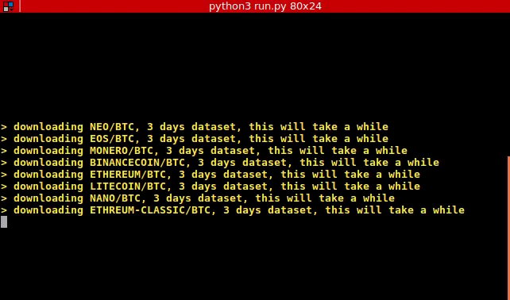
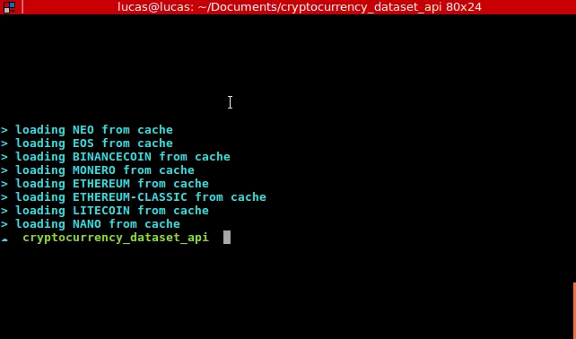

# Cryptocurrency datasets API

Multitrading wrapper to get timeseries any of 2000+ cryptocurrencys listed on [coingekko](https://api.coingecko.com/api/v3/coins/list)

## Enviroment

- Ubuntu 16.04
- Python 3.5.2
- Pip 8.1.1

## Setup

Go to `configs.py` and customize:
```python
path = 'datasets'
coins = ['neo','eos','binancecoin','monero','ethereum','ethereum-classic','litecoin','nano']
days = 3
currency = 'btc' # usd, jpy, eth, eur
keys = ['prices', 'total_volumes', 'market_caps']
```
---
## Run

```sh
# from project root
mkdir datasets
pip3 install -r requirements.txt
python3 run.py
```




## Data structure

A csv file will be saved in `datasets/[day-month]_[coin]_[days]_[currency].csv` with this structure:

| date                | market_caps  | prices      | total_volumes |
|---------------------|--------------|-------------|---------------|
| 2018-08-18 08:50:23 | 755255.53351 | 0.000833130 | 226557.457554 |
| 2018-08-18 08:50:30 | 750862.71599 | 0.000827732 | 229988.250644 |
| ...                 | ...          | ...         | ...           |
